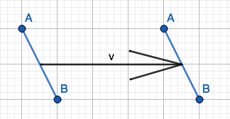
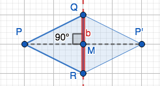

```{r setup, echo=F}
knitr::opts_chunk$set(error=FALSE, 
                      message= FALSE,
                      warning=FALSE,
                      echo=FALSE)
```


## Parallelogram 

Both pairs of opposite sides are parallel. 


```{r parallelogram, out.width = "40%", fig.align='center', fig.cap='**Fig. 1: ** Parallelogram'}
knitr::include_graphics("img/img1.png")
```

- $AB\parallel DC$

- $CB\parallel DA$


## Rhombus

Parallelogram whose sides are all the same length. 

```{r rhombus, out.width = "40%", fig.align='center', fig.cap='**Fig. 2: ** Rhombus'}
knitr::include_graphics("img/img1.png")
```

- $\overline{AB}=\overline{BC}=\overline{CD}=\overline{DA}$

## Isometry

Rotations, reflections, translations, and compositions of these that preserve distance, length, and angle measure. “rigid motion”

### Translations

Move all the points across a vector $\vec{v}$. 

Notation: $\tau_{\text{start point,end point}}$

```{r translations, out.width = "40%", fig.align='center', fig.cap='**Fig. 3: ** Translation of line AB along vector v.'}

```

### Rotations 

Pick a center O (origin), $\theta$ (angle), takes P to P' on a circle on a circle with center O and radius $\overline{OP}$ with $\angle POP'=\theta$. 

Notation: $R_{O,\theta}$

```{r rotation, out.width = "40%", fig.align='center', fig.cap='**Fig. 4: ** Rotation of line OP.'}
knitr::include_graphics("img/img9.png")
```

### Reflections 

Mirror of a shape across a line. 

Pick line b. 

- Points on B don't move.

- Points not on b, P, go to P' where b is perpendicular to bisector of $\overline{PP'}$. 

- Midpoint m of PP' on b make right angle $\overline{PP'}$

Notation: $r_{b}$

```{r reflection, out.width = "40%", fig.align='center', fig.cap='**Fig. 5: ** Triangle QPR reflected across line b.'}

```

### Composition

Combinations of rotations, reflections, and translations. 

## Symmetry

An isometry that sends a geometric figure to itself.

Example: 


## Group 

The set of isometries with composition is a group. 

0. Closure 

    - Order doesn't matter

    - $ab=ba$

1. Associativity 

    - Parentheses don't matter

    - $(ab)c=a(bc)$

2. Identity 

    - Anything combined with the identity equals itself.

    - $ea=ae=a$

3. Inverses 

    - undoes isometry 

    - $f^{-1}(f(a))=a$


