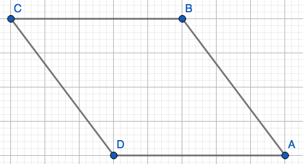
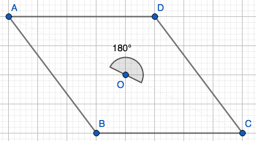
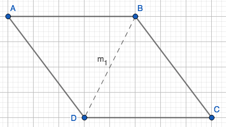

```{r setup, echo=F}
knitr::opts_chunk$set(error=FALSE, 
                      message= FALSE,
                      warning=FALSE,
                      echo=FALSE)
```

There are 4 symmetries of R (using Boyce's notation). 

## $e$

```{r id, out.width = "40%", fig.align='center', fig.cap='Identity'}

```

## $R_{O,180^\circ}$:

```{r rotation, out.width = "40%", fig.align='center', fig.cap='Rotation about center (O) by $180^o$.'}

```

## $r_{m_1}$:
```{r reflection 1, out.width = "40%", fig.align='center', fig.cap='Reflection over $m_1$'}

```

## $r_{m_2}$: 

```{r reflection 2, out.width = "40%", fig.align='center', fig.cap='Reflection over $m_2$'}
knitr::include_graphics("img/img5.png")
```

## Verify

To veryify this we can imagine the first letter only has two places to choose from, then the second letter only has two places to choose from, and then the last two letters only have one place to choose i.e. $2\cdot 2\cdot 1\cdot 1=4$. Therefore there are only four possible symmetries of R. 